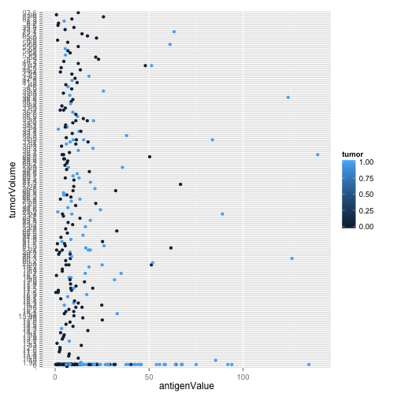
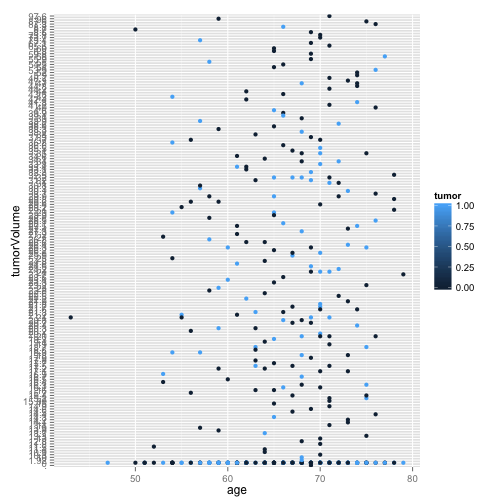
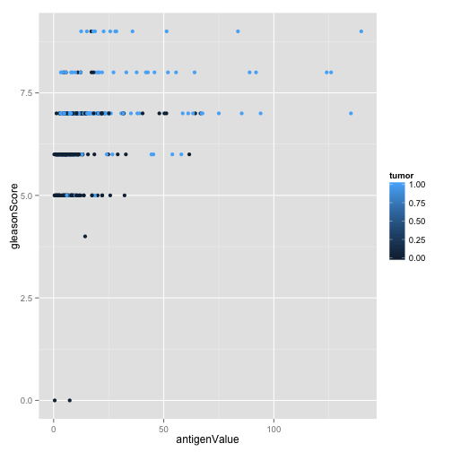
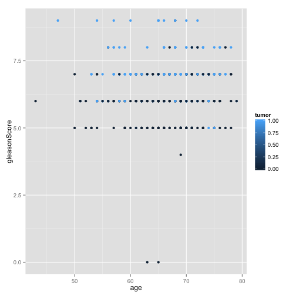
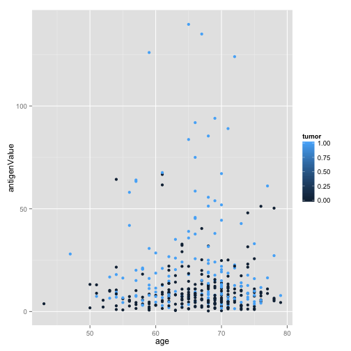

Resampling Methods - Chapter 5
========================================================
### Loading Prostate Cancer dataset into R


```r
library(ggplot2)
prostate_cancer <- read.table("~/Documents/github/stat_learning/data/prostate_caner.dat", quote="\"")
colnames(prostate_cancer)[1] <- "idCode"
colnames(prostate_cancer)[2] <- "tumor"
colnames(prostate_cancer)[3] <- "age"
colnames(prostate_cancer)[4] <- "race"
colnames(prostate_cancer)[5] <- "rectalExamResult"
colnames(prostate_cancer)[6] <- "capsularInvolvement"
colnames(prostate_cancer)[7] <- "antigenValue"
colnames(prostate_cancer)[8] <- "tumorVolume"
colnames(prostate_cancer)[9] <- "gleasonScore"
prostate_cancer$race <- as.factor(prostate_cancer$race)
prostate_cancer$rectalExamResult <- as.factor(prostate_cancer$rectalExamResult)


attach(prostate_cancer)
```

### Plots of various predictors colored by whether it is cancerous or not


```r
ggplot(data=prostate_cancer,aes(x=antigenValue,y=tumorVolume,col=tumor))+geom_point()
```

 

```r
ggplot(data=prostate_cancer,aes(x=age,y=tumorVolume,col=tumor))+geom_point()
```

 

```r
ggplot(data=prostate_cancer,aes(x=antigenValue,y=gleasonScore,col=tumor))+geom_point()
```

 

```r
ggplot(data=prostate_cancer,aes(x=age,y=gleasonScore,col=tumor))+geom_point()
```

 

```r
ggplot(data=prostate_cancer,aes(x=age,y=antigenValue,col=tumor))+geom_point()
```

 

###  Using the Validation Set Method to Calculate MSE


```r
train=sample(380,200)
glm.fit=glm(tumor~age+rectalExamResult+capsularInvolvement+antigenValue+gleasonScore,data=prostate_cancer,family = binomial,subset=train)
mean((tumor-predict(glm.fit,prostate_cancer, type="response"))[-train]^2)
```

```
## [1] 0.175
```


###  Using the Leave One Out Cross-Validation Set

```r
library(boot)
glm.fit=glm(tumor~age+rectalExamResult+capsularInvolvement+antigenValue+gleasonScore,data=prostate_cancer,family = binomial)
coef(glm.fit)
```

```
##         (Intercept)                 age   rectalExamResult2 
##            -7.86572            -0.01080             0.73326 
##   rectalExamResult3   rectalExamResult4 capsularInvolvement 
##             1.49780             1.36615             0.53790 
##        antigenValue        gleasonScore 
##             0.02668             0.97896
```

```r
kfCV <- cv.glm(data=prostate_cancer, glmfit=glm.fit)
kfCV$delta
```

```
## [1] 0.1741 0.1740
```

### Polynomial Logistic Regression using Leave One Out Cross-Validation

```r
cv.error=rep(0,5)
for (i in 1:5){
  glm.fit=glm(tumor~age+rectalExamResult+capsularInvolvement+poly(antigenValue,i)+poly(gleasonScore,i),data=prostate_cancer,family = binomial)
  cv.error[i]=cv.glm(data=prostate_cancer, glmfit=glm.fit)$delta[1]
}
```

```
## Warning: glm.fit: fitted probabilities numerically 0 or 1 occurred
## Warning: glm.fit: fitted probabilities numerically 0 or 1 occurred
## Warning: glm.fit: fitted probabilities numerically 0 or 1 occurred
## Warning: glm.fit: fitted probabilities numerically 0 or 1 occurred
## Warning: glm.fit: fitted probabilities numerically 0 or 1 occurred
## Warning: glm.fit: fitted probabilities numerically 0 or 1 occurred
## Warning: glm.fit: fitted probabilities numerically 0 or 1 occurred
## Warning: glm.fit: fitted probabilities numerically 0 or 1 occurred
## Warning: glm.fit: fitted probabilities numerically 0 or 1 occurred
## Warning: glm.fit: fitted probabilities numerically 0 or 1 occurred
## Warning: glm.fit: fitted probabilities numerically 0 or 1 occurred
## Warning: glm.fit: fitted probabilities numerically 0 or 1 occurred
## Warning: glm.fit: fitted probabilities numerically 0 or 1 occurred
## Warning: glm.fit: fitted probabilities numerically 0 or 1 occurred
## Warning: glm.fit: fitted probabilities numerically 0 or 1 occurred
## Warning: glm.fit: fitted probabilities numerically 0 or 1 occurred
## Warning: glm.fit: fitted probabilities numerically 0 or 1 occurred
## Warning: glm.fit: fitted probabilities numerically 0 or 1 occurred
## Warning: glm.fit: fitted probabilities numerically 0 or 1 occurred
## Warning: glm.fit: fitted probabilities numerically 0 or 1 occurred
## Warning: glm.fit: fitted probabilities numerically 0 or 1 occurred
## Warning: glm.fit: fitted probabilities numerically 0 or 1 occurred
## Warning: glm.fit: fitted probabilities numerically 0 or 1 occurred
## Warning: glm.fit: fitted probabilities numerically 0 or 1 occurred
## Warning: glm.fit: fitted probabilities numerically 0 or 1 occurred
## Warning: glm.fit: fitted probabilities numerically 0 or 1 occurred
## Warning: glm.fit: fitted probabilities numerically 0 or 1 occurred
## Warning: glm.fit: fitted probabilities numerically 0 or 1 occurred
## Warning: glm.fit: fitted probabilities numerically 0 or 1 occurred
## Warning: glm.fit: fitted probabilities numerically 0 or 1 occurred
## Warning: glm.fit: fitted probabilities numerically 0 or 1 occurred
## Warning: glm.fit: fitted probabilities numerically 0 or 1 occurred
## Warning: glm.fit: fitted probabilities numerically 0 or 1 occurred
## Warning: glm.fit: fitted probabilities numerically 0 or 1 occurred
## Warning: glm.fit: fitted probabilities numerically 0 or 1 occurred
## Warning: glm.fit: fitted probabilities numerically 0 or 1 occurred
## Warning: glm.fit: fitted probabilities numerically 0 or 1 occurred
## Warning: glm.fit: fitted probabilities numerically 0 or 1 occurred
## Warning: glm.fit: fitted probabilities numerically 0 or 1 occurred
## Warning: glm.fit: fitted probabilities numerically 0 or 1 occurred
## Warning: glm.fit: fitted probabilities numerically 0 or 1 occurred
## Warning: glm.fit: fitted probabilities numerically 0 or 1 occurred
## Warning: glm.fit: fitted probabilities numerically 0 or 1 occurred
## Warning: glm.fit: fitted probabilities numerically 0 or 1 occurred
## Warning: glm.fit: fitted probabilities numerically 0 or 1 occurred
## Warning: glm.fit: fitted probabilities numerically 0 or 1 occurred
## Warning: glm.fit: fitted probabilities numerically 0 or 1 occurred
## Warning: glm.fit: fitted probabilities numerically 0 or 1 occurred
## Warning: glm.fit: fitted probabilities numerically 0 or 1 occurred
## Warning: glm.fit: fitted probabilities numerically 0 or 1 occurred
## Warning: glm.fit: fitted probabilities numerically 0 or 1 occurred
## Warning: glm.fit: fitted probabilities numerically 0 or 1 occurred
## Warning: glm.fit: fitted probabilities numerically 0 or 1 occurred
## Warning: glm.fit: fitted probabilities numerically 0 or 1 occurred
## Warning: glm.fit: fitted probabilities numerically 0 or 1 occurred
## Warning: glm.fit: fitted probabilities numerically 0 or 1 occurred
## Warning: glm.fit: fitted probabilities numerically 0 or 1 occurred
## Warning: glm.fit: fitted probabilities numerically 0 or 1 occurred
## Warning: glm.fit: fitted probabilities numerically 0 or 1 occurred
## Warning: glm.fit: fitted probabilities numerically 0 or 1 occurred
## Warning: glm.fit: fitted probabilities numerically 0 or 1 occurred
## Warning: glm.fit: fitted probabilities numerically 0 or 1 occurred
## Warning: glm.fit: fitted probabilities numerically 0 or 1 occurred
## Warning: glm.fit: fitted probabilities numerically 0 or 1 occurred
## Warning: glm.fit: fitted probabilities numerically 0 or 1 occurred
## Warning: glm.fit: fitted probabilities numerically 0 or 1 occurred
## Warning: glm.fit: fitted probabilities numerically 0 or 1 occurred
## Warning: glm.fit: fitted probabilities numerically 0 or 1 occurred
## Warning: glm.fit: fitted probabilities numerically 0 or 1 occurred
## Warning: glm.fit: fitted probabilities numerically 0 or 1 occurred
## Warning: glm.fit: fitted probabilities numerically 0 or 1 occurred
## Warning: glm.fit: fitted probabilities numerically 0 or 1 occurred
## Warning: glm.fit: fitted probabilities numerically 0 or 1 occurred
## Warning: glm.fit: fitted probabilities numerically 0 or 1 occurred
## Warning: glm.fit: fitted probabilities numerically 0 or 1 occurred
## Warning: glm.fit: fitted probabilities numerically 0 or 1 occurred
## Warning: glm.fit: fitted probabilities numerically 0 or 1 occurred
## Warning: glm.fit: fitted probabilities numerically 0 or 1 occurred
## Warning: glm.fit: fitted probabilities numerically 0 or 1 occurred
## Warning: glm.fit: fitted probabilities numerically 0 or 1 occurred
## Warning: glm.fit: fitted probabilities numerically 0 or 1 occurred
## Warning: glm.fit: fitted probabilities numerically 0 or 1 occurred
## Warning: glm.fit: fitted probabilities numerically 0 or 1 occurred
## Warning: glm.fit: fitted probabilities numerically 0 or 1 occurred
## Warning: glm.fit: fitted probabilities numerically 0 or 1 occurred
## Warning: glm.fit: fitted probabilities numerically 0 or 1 occurred
## Warning: glm.fit: fitted probabilities numerically 0 or 1 occurred
## Warning: glm.fit: fitted probabilities numerically 0 or 1 occurred
## Warning: glm.fit: fitted probabilities numerically 0 or 1 occurred
## Warning: glm.fit: fitted probabilities numerically 0 or 1 occurred
## Warning: glm.fit: fitted probabilities numerically 0 or 1 occurred
## Warning: glm.fit: fitted probabilities numerically 0 or 1 occurred
## Warning: glm.fit: fitted probabilities numerically 0 or 1 occurred
## Warning: glm.fit: fitted probabilities numerically 0 or 1 occurred
## Warning: glm.fit: fitted probabilities numerically 0 or 1 occurred
## Warning: glm.fit: fitted probabilities numerically 0 or 1 occurred
## Warning: glm.fit: fitted probabilities numerically 0 or 1 occurred
## Warning: glm.fit: fitted probabilities numerically 0 or 1 occurred
## Warning: glm.fit: fitted probabilities numerically 0 or 1 occurred
## Warning: glm.fit: fitted probabilities numerically 0 or 1 occurred
## Warning: glm.fit: fitted probabilities numerically 0 or 1 occurred
## Warning: glm.fit: fitted probabilities numerically 0 or 1 occurred
## Warning: glm.fit: fitted probabilities numerically 0 or 1 occurred
## Warning: glm.fit: fitted probabilities numerically 0 or 1 occurred
## Warning: glm.fit: fitted probabilities numerically 0 or 1 occurred
## Warning: glm.fit: fitted probabilities numerically 0 or 1 occurred
## Warning: glm.fit: fitted probabilities numerically 0 or 1 occurred
## Warning: glm.fit: fitted probabilities numerically 0 or 1 occurred
## Warning: glm.fit: fitted probabilities numerically 0 or 1 occurred
## Warning: glm.fit: fitted probabilities numerically 0 or 1 occurred
## Warning: glm.fit: fitted probabilities numerically 0 or 1 occurred
## Warning: glm.fit: fitted probabilities numerically 0 or 1 occurred
## Warning: glm.fit: fitted probabilities numerically 0 or 1 occurred
## Warning: glm.fit: fitted probabilities numerically 0 or 1 occurred
## Warning: glm.fit: fitted probabilities numerically 0 or 1 occurred
## Warning: glm.fit: fitted probabilities numerically 0 or 1 occurred
## Warning: glm.fit: fitted probabilities numerically 0 or 1 occurred
## Warning: glm.fit: fitted probabilities numerically 0 or 1 occurred
## Warning: glm.fit: fitted probabilities numerically 0 or 1 occurred
## Warning: glm.fit: fitted probabilities numerically 0 or 1 occurred
## Warning: glm.fit: fitted probabilities numerically 0 or 1 occurred
## Warning: glm.fit: fitted probabilities numerically 0 or 1 occurred
## Warning: glm.fit: fitted probabilities numerically 0 or 1 occurred
## Warning: glm.fit: fitted probabilities numerically 0 or 1 occurred
## Warning: glm.fit: fitted probabilities numerically 0 or 1 occurred
## Warning: glm.fit: fitted probabilities numerically 0 or 1 occurred
## Warning: glm.fit: fitted probabilities numerically 0 or 1 occurred
## Warning: glm.fit: fitted probabilities numerically 0 or 1 occurred
## Warning: glm.fit: fitted probabilities numerically 0 or 1 occurred
## Warning: glm.fit: fitted probabilities numerically 0 or 1 occurred
## Warning: glm.fit: fitted probabilities numerically 0 or 1 occurred
## Warning: glm.fit: fitted probabilities numerically 0 or 1 occurred
## Warning: glm.fit: fitted probabilities numerically 0 or 1 occurred
## Warning: glm.fit: fitted probabilities numerically 0 or 1 occurred
## Warning: glm.fit: fitted probabilities numerically 0 or 1 occurred
## Warning: glm.fit: fitted probabilities numerically 0 or 1 occurred
## Warning: glm.fit: fitted probabilities numerically 0 or 1 occurred
## Warning: glm.fit: fitted probabilities numerically 0 or 1 occurred
## Warning: glm.fit: fitted probabilities numerically 0 or 1 occurred
## Warning: glm.fit: fitted probabilities numerically 0 or 1 occurred
## Warning: glm.fit: fitted probabilities numerically 0 or 1 occurred
## Warning: glm.fit: fitted probabilities numerically 0 or 1 occurred
## Warning: glm.fit: fitted probabilities numerically 0 or 1 occurred
## Warning: glm.fit: fitted probabilities numerically 0 or 1 occurred
## Warning: glm.fit: fitted probabilities numerically 0 or 1 occurred
## Warning: glm.fit: fitted probabilities numerically 0 or 1 occurred
## Warning: glm.fit: fitted probabilities numerically 0 or 1 occurred
## Warning: glm.fit: fitted probabilities numerically 0 or 1 occurred
## Warning: glm.fit: fitted probabilities numerically 0 or 1 occurred
## Warning: glm.fit: fitted probabilities numerically 0 or 1 occurred
## Warning: glm.fit: fitted probabilities numerically 0 or 1 occurred
## Warning: glm.fit: fitted probabilities numerically 0 or 1 occurred
## Warning: glm.fit: fitted probabilities numerically 0 or 1 occurred
## Warning: glm.fit: fitted probabilities numerically 0 or 1 occurred
## Warning: glm.fit: fitted probabilities numerically 0 or 1 occurred
## Warning: glm.fit: fitted probabilities numerically 0 or 1 occurred
## Warning: glm.fit: fitted probabilities numerically 0 or 1 occurred
## Warning: glm.fit: fitted probabilities numerically 0 or 1 occurred
## Warning: glm.fit: fitted probabilities numerically 0 or 1 occurred
## Warning: glm.fit: fitted probabilities numerically 0 or 1 occurred
## Warning: glm.fit: fitted probabilities numerically 0 or 1 occurred
## Warning: glm.fit: fitted probabilities numerically 0 or 1 occurred
## Warning: glm.fit: fitted probabilities numerically 0 or 1 occurred
## Warning: glm.fit: fitted probabilities numerically 0 or 1 occurred
## Warning: glm.fit: fitted probabilities numerically 0 or 1 occurred
## Warning: glm.fit: fitted probabilities numerically 0 or 1 occurred
## Warning: glm.fit: fitted probabilities numerically 0 or 1 occurred
## Warning: glm.fit: fitted probabilities numerically 0 or 1 occurred
## Warning: glm.fit: fitted probabilities numerically 0 or 1 occurred
## Warning: glm.fit: fitted probabilities numerically 0 or 1 occurred
## Warning: glm.fit: fitted probabilities numerically 0 or 1 occurred
## Warning: glm.fit: fitted probabilities numerically 0 or 1 occurred
## Warning: glm.fit: fitted probabilities numerically 0 or 1 occurred
## Warning: glm.fit: fitted probabilities numerically 0 or 1 occurred
## Warning: glm.fit: fitted probabilities numerically 0 or 1 occurred
## Warning: glm.fit: fitted probabilities numerically 0 or 1 occurred
## Warning: glm.fit: fitted probabilities numerically 0 or 1 occurred
## Warning: glm.fit: fitted probabilities numerically 0 or 1 occurred
## Warning: glm.fit: fitted probabilities numerically 0 or 1 occurred
## Warning: glm.fit: fitted probabilities numerically 0 or 1 occurred
## Warning: glm.fit: fitted probabilities numerically 0 or 1 occurred
## Warning: glm.fit: fitted probabilities numerically 0 or 1 occurred
## Warning: glm.fit: fitted probabilities numerically 0 or 1 occurred
## Warning: glm.fit: fitted probabilities numerically 0 or 1 occurred
## Warning: glm.fit: fitted probabilities numerically 0 or 1 occurred
## Warning: glm.fit: fitted probabilities numerically 0 or 1 occurred
## Warning: glm.fit: fitted probabilities numerically 0 or 1 occurred
## Warning: glm.fit: fitted probabilities numerically 0 or 1 occurred
## Warning: glm.fit: fitted probabilities numerically 0 or 1 occurred
## Warning: glm.fit: fitted probabilities numerically 0 or 1 occurred
## Warning: glm.fit: fitted probabilities numerically 0 or 1 occurred
## Warning: glm.fit: fitted probabilities numerically 0 or 1 occurred
## Warning: glm.fit: fitted probabilities numerically 0 or 1 occurred
## Warning: glm.fit: fitted probabilities numerically 0 or 1 occurred
## Warning: glm.fit: fitted probabilities numerically 0 or 1 occurred
## Warning: glm.fit: fitted probabilities numerically 0 or 1 occurred
## Warning: glm.fit: fitted probabilities numerically 0 or 1 occurred
## Warning: glm.fit: fitted probabilities numerically 0 or 1 occurred
## Warning: glm.fit: fitted probabilities numerically 0 or 1 occurred
## Warning: glm.fit: fitted probabilities numerically 0 or 1 occurred
## Warning: glm.fit: fitted probabilities numerically 0 or 1 occurred
## Warning: glm.fit: fitted probabilities numerically 0 or 1 occurred
## Warning: glm.fit: fitted probabilities numerically 0 or 1 occurred
## Warning: glm.fit: fitted probabilities numerically 0 or 1 occurred
## Warning: glm.fit: fitted probabilities numerically 0 or 1 occurred
## Warning: glm.fit: fitted probabilities numerically 0 or 1 occurred
## Warning: glm.fit: fitted probabilities numerically 0 or 1 occurred
## Warning: glm.fit: fitted probabilities numerically 0 or 1 occurred
## Warning: glm.fit: fitted probabilities numerically 0 or 1 occurred
## Warning: glm.fit: fitted probabilities numerically 0 or 1 occurred
## Warning: glm.fit: fitted probabilities numerically 0 or 1 occurred
## Warning: glm.fit: fitted probabilities numerically 0 or 1 occurred
## Warning: glm.fit: fitted probabilities numerically 0 or 1 occurred
## Warning: glm.fit: fitted probabilities numerically 0 or 1 occurred
## Warning: glm.fit: fitted probabilities numerically 0 or 1 occurred
## Warning: glm.fit: fitted probabilities numerically 0 or 1 occurred
## Warning: glm.fit: fitted probabilities numerically 0 or 1 occurred
## Warning: glm.fit: fitted probabilities numerically 0 or 1 occurred
## Warning: glm.fit: fitted probabilities numerically 0 or 1 occurred
## Warning: glm.fit: fitted probabilities numerically 0 or 1 occurred
## Warning: glm.fit: fitted probabilities numerically 0 or 1 occurred
## Warning: glm.fit: fitted probabilities numerically 0 or 1 occurred
## Warning: glm.fit: fitted probabilities numerically 0 or 1 occurred
## Warning: glm.fit: fitted probabilities numerically 0 or 1 occurred
## Warning: glm.fit: fitted probabilities numerically 0 or 1 occurred
## Warning: glm.fit: fitted probabilities numerically 0 or 1 occurred
## Warning: glm.fit: fitted probabilities numerically 0 or 1 occurred
## Warning: glm.fit: fitted probabilities numerically 0 or 1 occurred
## Warning: glm.fit: fitted probabilities numerically 0 or 1 occurred
## Warning: glm.fit: fitted probabilities numerically 0 or 1 occurred
## Warning: glm.fit: fitted probabilities numerically 0 or 1 occurred
## Warning: glm.fit: fitted probabilities numerically 0 or 1 occurred
## Warning: glm.fit: fitted probabilities numerically 0 or 1 occurred
## Warning: glm.fit: fitted probabilities numerically 0 or 1 occurred
## Warning: glm.fit: fitted probabilities numerically 0 or 1 occurred
## Warning: glm.fit: fitted probabilities numerically 0 or 1 occurred
## Warning: glm.fit: fitted probabilities numerically 0 or 1 occurred
## Warning: glm.fit: fitted probabilities numerically 0 or 1 occurred
## Warning: glm.fit: fitted probabilities numerically 0 or 1 occurred
## Warning: glm.fit: fitted probabilities numerically 0 or 1 occurred
## Warning: glm.fit: fitted probabilities numerically 0 or 1 occurred
## Warning: glm.fit: fitted probabilities numerically 0 or 1 occurred
## Warning: glm.fit: fitted probabilities numerically 0 or 1 occurred
## Warning: glm.fit: fitted probabilities numerically 0 or 1 occurred
## Warning: glm.fit: fitted probabilities numerically 0 or 1 occurred
## Warning: glm.fit: fitted probabilities numerically 0 or 1 occurred
## Warning: glm.fit: fitted probabilities numerically 0 or 1 occurred
## Warning: glm.fit: fitted probabilities numerically 0 or 1 occurred
## Warning: glm.fit: fitted probabilities numerically 0 or 1 occurred
## Warning: glm.fit: fitted probabilities numerically 0 or 1 occurred
## Warning: glm.fit: fitted probabilities numerically 0 or 1 occurred
## Warning: glm.fit: fitted probabilities numerically 0 or 1 occurred
## Warning: glm.fit: fitted probabilities numerically 0 or 1 occurred
## Warning: glm.fit: fitted probabilities numerically 0 or 1 occurred
## Warning: glm.fit: fitted probabilities numerically 0 or 1 occurred
## Warning: glm.fit: fitted probabilities numerically 0 or 1 occurred
## Warning: glm.fit: fitted probabilities numerically 0 or 1 occurred
## Warning: glm.fit: fitted probabilities numerically 0 or 1 occurred
## Warning: glm.fit: fitted probabilities numerically 0 or 1 occurred
## Warning: glm.fit: fitted probabilities numerically 0 or 1 occurred
## Warning: glm.fit: fitted probabilities numerically 0 or 1 occurred
## Warning: glm.fit: fitted probabilities numerically 0 or 1 occurred
## Warning: glm.fit: fitted probabilities numerically 0 or 1 occurred
## Warning: glm.fit: fitted probabilities numerically 0 or 1 occurred
## Warning: glm.fit: fitted probabilities numerically 0 or 1 occurred
## Warning: glm.fit: fitted probabilities numerically 0 or 1 occurred
## Warning: glm.fit: fitted probabilities numerically 0 or 1 occurred
## Warning: glm.fit: fitted probabilities numerically 0 or 1 occurred
## Warning: glm.fit: fitted probabilities numerically 0 or 1 occurred
## Warning: glm.fit: fitted probabilities numerically 0 or 1 occurred
## Warning: glm.fit: fitted probabilities numerically 0 or 1 occurred
## Warning: glm.fit: fitted probabilities numerically 0 or 1 occurred
## Warning: glm.fit: fitted probabilities numerically 0 or 1 occurred
## Warning: glm.fit: fitted probabilities numerically 0 or 1 occurred
## Warning: glm.fit: fitted probabilities numerically 0 or 1 occurred
## Warning: glm.fit: fitted probabilities numerically 0 or 1 occurred
## Warning: glm.fit: fitted probabilities numerically 0 or 1 occurred
## Warning: glm.fit: fitted probabilities numerically 0 or 1 occurred
## Warning: glm.fit: fitted probabilities numerically 0 or 1 occurred
## Warning: glm.fit: fitted probabilities numerically 0 or 1 occurred
## Warning: glm.fit: fitted probabilities numerically 0 or 1 occurred
## Warning: glm.fit: fitted probabilities numerically 0 or 1 occurred
## Warning: glm.fit: fitted probabilities numerically 0 or 1 occurred
## Warning: glm.fit: fitted probabilities numerically 0 or 1 occurred
## Warning: glm.fit: fitted probabilities numerically 0 or 1 occurred
## Warning: glm.fit: fitted probabilities numerically 0 or 1 occurred
## Warning: glm.fit: fitted probabilities numerically 0 or 1 occurred
## Warning: glm.fit: fitted probabilities numerically 0 or 1 occurred
## Warning: glm.fit: fitted probabilities numerically 0 or 1 occurred
## Warning: glm.fit: fitted probabilities numerically 0 or 1 occurred
## Warning: glm.fit: fitted probabilities numerically 0 or 1 occurred
## Warning: glm.fit: fitted probabilities numerically 0 or 1 occurred
## Warning: glm.fit: fitted probabilities numerically 0 or 1 occurred
## Warning: glm.fit: fitted probabilities numerically 0 or 1 occurred
## Warning: glm.fit: fitted probabilities numerically 0 or 1 occurred
## Warning: glm.fit: fitted probabilities numerically 0 or 1 occurred
## Warning: glm.fit: fitted probabilities numerically 0 or 1 occurred
## Warning: glm.fit: fitted probabilities numerically 0 or 1 occurred
## Warning: glm.fit: fitted probabilities numerically 0 or 1 occurred
## Warning: glm.fit: fitted probabilities numerically 0 or 1 occurred
## Warning: glm.fit: fitted probabilities numerically 0 or 1 occurred
## Warning: glm.fit: fitted probabilities numerically 0 or 1 occurred
## Warning: glm.fit: fitted probabilities numerically 0 or 1 occurred
## Warning: glm.fit: fitted probabilities numerically 0 or 1 occurred
## Warning: glm.fit: fitted probabilities numerically 0 or 1 occurred
## Warning: glm.fit: fitted probabilities numerically 0 or 1 occurred
## Warning: glm.fit: fitted probabilities numerically 0 or 1 occurred
## Warning: glm.fit: fitted probabilities numerically 0 or 1 occurred
## Warning: glm.fit: fitted probabilities numerically 0 or 1 occurred
## Warning: glm.fit: fitted probabilities numerically 0 or 1 occurred
## Warning: glm.fit: fitted probabilities numerically 0 or 1 occurred
## Warning: glm.fit: fitted probabilities numerically 0 or 1 occurred
## Warning: glm.fit: fitted probabilities numerically 0 or 1 occurred
## Warning: glm.fit: fitted probabilities numerically 0 or 1 occurred
## Warning: glm.fit: fitted probabilities numerically 0 or 1 occurred
## Warning: glm.fit: fitted probabilities numerically 0 or 1 occurred
## Warning: glm.fit: fitted probabilities numerically 0 or 1 occurred
## Warning: glm.fit: fitted probabilities numerically 0 or 1 occurred
## Warning: glm.fit: fitted probabilities numerically 0 or 1 occurred
## Warning: glm.fit: fitted probabilities numerically 0 or 1 occurred
## Warning: glm.fit: fitted probabilities numerically 0 or 1 occurred
## Warning: glm.fit: fitted probabilities numerically 0 or 1 occurred
## Warning: glm.fit: fitted probabilities numerically 0 or 1 occurred
## Warning: glm.fit: fitted probabilities numerically 0 or 1 occurred
## Warning: glm.fit: fitted probabilities numerically 0 or 1 occurred
## Warning: glm.fit: fitted probabilities numerically 0 or 1 occurred
## Warning: glm.fit: fitted probabilities numerically 0 or 1 occurred
## Warning: glm.fit: fitted probabilities numerically 0 or 1 occurred
## Warning: glm.fit: fitted probabilities numerically 0 or 1 occurred
## Warning: glm.fit: fitted probabilities numerically 0 or 1 occurred
## Warning: glm.fit: fitted probabilities numerically 0 or 1 occurred
## Warning: glm.fit: fitted probabilities numerically 0 or 1 occurred
## Warning: glm.fit: fitted probabilities numerically 0 or 1 occurred
## Warning: glm.fit: fitted probabilities numerically 0 or 1 occurred
## Warning: glm.fit: fitted probabilities numerically 0 or 1 occurred
## Warning: glm.fit: fitted probabilities numerically 0 or 1 occurred
## Warning: glm.fit: fitted probabilities numerically 0 or 1 occurred
## Warning: glm.fit: fitted probabilities numerically 0 or 1 occurred
## Warning: glm.fit: fitted probabilities numerically 0 or 1 occurred
## Warning: glm.fit: fitted probabilities numerically 0 or 1 occurred
## Warning: glm.fit: fitted probabilities numerically 0 or 1 occurred
## Warning: glm.fit: fitted probabilities numerically 0 or 1 occurred
## Warning: glm.fit: fitted probabilities numerically 0 or 1 occurred
## Warning: glm.fit: fitted probabilities numerically 0 or 1 occurred
## Warning: glm.fit: fitted probabilities numerically 0 or 1 occurred
## Warning: glm.fit: fitted probabilities numerically 0 or 1 occurred
## Warning: glm.fit: fitted probabilities numerically 0 or 1 occurred
## Warning: glm.fit: fitted probabilities numerically 0 or 1 occurred
## Warning: glm.fit: fitted probabilities numerically 0 or 1 occurred
## Warning: glm.fit: fitted probabilities numerically 0 or 1 occurred
## Warning: glm.fit: fitted probabilities numerically 0 or 1 occurred
## Warning: glm.fit: fitted probabilities numerically 0 or 1 occurred
## Warning: glm.fit: fitted probabilities numerically 0 or 1 occurred
## Warning: glm.fit: fitted probabilities numerically 0 or 1 occurred
## Warning: glm.fit: fitted probabilities numerically 0 or 1 occurred
## Warning: glm.fit: fitted probabilities numerically 0 or 1 occurred
## Warning: glm.fit: fitted probabilities numerically 0 or 1 occurred
## Warning: glm.fit: fitted probabilities numerically 0 or 1 occurred
## Warning: glm.fit: fitted probabilities numerically 0 or 1 occurred
## Warning: glm.fit: fitted probabilities numerically 0 or 1 occurred
## Warning: glm.fit: fitted probabilities numerically 0 or 1 occurred
## Warning: glm.fit: fitted probabilities numerically 0 or 1 occurred
## Warning: glm.fit: fitted probabilities numerically 0 or 1 occurred
## Warning: glm.fit: fitted probabilities numerically 0 or 1 occurred
## Warning: glm.fit: fitted probabilities numerically 0 or 1 occurred
## Warning: glm.fit: fitted probabilities numerically 0 or 1 occurred
## Warning: glm.fit: fitted probabilities numerically 0 or 1 occurred
## Warning: glm.fit: fitted probabilities numerically 0 or 1 occurred
## Warning: glm.fit: fitted probabilities numerically 0 or 1 occurred
## Warning: glm.fit: fitted probabilities numerically 0 or 1 occurred
## Warning: glm.fit: fitted probabilities numerically 0 or 1 occurred
## Warning: glm.fit: fitted probabilities numerically 0 or 1 occurred
## Warning: glm.fit: fitted probabilities numerically 0 or 1 occurred
## Warning: glm.fit: fitted probabilities numerically 0 or 1 occurred
## Warning: glm.fit: fitted probabilities numerically 0 or 1 occurred
## Warning: glm.fit: fitted probabilities numerically 0 or 1 occurred
## Warning: glm.fit: fitted probabilities numerically 0 or 1 occurred
## Warning: glm.fit: fitted probabilities numerically 0 or 1 occurred
## Warning: glm.fit: fitted probabilities numerically 0 or 1 occurred
## Warning: glm.fit: fitted probabilities numerically 0 or 1 occurred
## Warning: glm.fit: fitted probabilities numerically 0 or 1 occurred
## Warning: glm.fit: fitted probabilities numerically 0 or 1 occurred
## Warning: glm.fit: fitted probabilities numerically 0 or 1 occurred
## Warning: glm.fit: fitted probabilities numerically 0 or 1 occurred
## Warning: glm.fit: fitted probabilities numerically 0 or 1 occurred
## Warning: glm.fit: fitted probabilities numerically 0 or 1 occurred
## Warning: glm.fit: fitted probabilities numerically 0 or 1 occurred
## Warning: glm.fit: fitted probabilities numerically 0 or 1 occurred
## Warning: glm.fit: fitted probabilities numerically 0 or 1 occurred
## Warning: glm.fit: fitted probabilities numerically 0 or 1 occurred
## Warning: glm.fit: fitted probabilities numerically 0 or 1 occurred
## Warning: glm.fit: fitted probabilities numerically 0 or 1 occurred
## Warning: glm.fit: fitted probabilities numerically 0 or 1 occurred
## Warning: glm.fit: fitted probabilities numerically 0 or 1 occurred
## Warning: glm.fit: fitted probabilities numerically 0 or 1 occurred
## Warning: glm.fit: fitted probabilities numerically 0 or 1 occurred
## Warning: glm.fit: fitted probabilities numerically 0 or 1 occurred
## Warning: glm.fit: fitted probabilities numerically 0 or 1 occurred
## Warning: glm.fit: fitted probabilities numerically 0 or 1 occurred
## Warning: glm.fit: fitted probabilities numerically 0 or 1 occurred
## Warning: glm.fit: fitted probabilities numerically 0 or 1 occurred
## Warning: glm.fit: fitted probabilities numerically 0 or 1 occurred
## Warning: glm.fit: fitted probabilities numerically 0 or 1 occurred
## Warning: glm.fit: fitted probabilities numerically 0 or 1 occurred
## Warning: glm.fit: fitted probabilities numerically 0 or 1 occurred
## Warning: glm.fit: fitted probabilities numerically 0 or 1 occurred
## Warning: glm.fit: fitted probabilities numerically 0 or 1 occurred
## Warning: glm.fit: fitted probabilities numerically 0 or 1 occurred
## Warning: glm.fit: fitted probabilities numerically 0 or 1 occurred
## Warning: glm.fit: fitted probabilities numerically 0 or 1 occurred
## Warning: glm.fit: fitted probabilities numerically 0 or 1 occurred
## Warning: glm.fit: fitted probabilities numerically 0 or 1 occurred
## Warning: glm.fit: fitted probabilities numerically 0 or 1 occurred
## Warning: glm.fit: fitted probabilities numerically 0 or 1 occurred
## Warning: glm.fit: fitted probabilities numerically 0 or 1 occurred
## Warning: glm.fit: fitted probabilities numerically 0 or 1 occurred
## Warning: glm.fit: fitted probabilities numerically 0 or 1 occurred
## Warning: glm.fit: fitted probabilities numerically 0 or 1 occurred
## Warning: glm.fit: fitted probabilities numerically 0 or 1 occurred
## Warning: glm.fit: fitted probabilities numerically 0 or 1 occurred
## Warning: glm.fit: fitted probabilities numerically 0 or 1 occurred
## Warning: glm.fit: fitted probabilities numerically 0 or 1 occurred
## Warning: glm.fit: fitted probabilities numerically 0 or 1 occurred
## Warning: glm.fit: fitted probabilities numerically 0 or 1 occurred
## Warning: glm.fit: fitted probabilities numerically 0 or 1 occurred
## Warning: glm.fit: fitted probabilities numerically 0 or 1 occurred
## Warning: glm.fit: fitted probabilities numerically 0 or 1 occurred
## Warning: glm.fit: fitted probabilities numerically 0 or 1 occurred
## Warning: glm.fit: fitted probabilities numerically 0 or 1 occurred
## Warning: glm.fit: fitted probabilities numerically 0 or 1 occurred
## Warning: glm.fit: fitted probabilities numerically 0 or 1 occurred
## Warning: glm.fit: fitted probabilities numerically 0 or 1 occurred
## Warning: glm.fit: fitted probabilities numerically 0 or 1 occurred
## Warning: glm.fit: fitted probabilities numerically 0 or 1 occurred
## Warning: glm.fit: fitted probabilities numerically 0 or 1 occurred
## Warning: glm.fit: fitted probabilities numerically 0 or 1 occurred
## Warning: glm.fit: fitted probabilities numerically 0 or 1 occurred
## Warning: glm.fit: fitted probabilities numerically 0 or 1 occurred
## Warning: glm.fit: fitted probabilities numerically 0 or 1 occurred
## Warning: glm.fit: fitted probabilities numerically 0 or 1 occurred
## Warning: glm.fit: fitted probabilities numerically 0 or 1 occurred
## Warning: glm.fit: fitted probabilities numerically 0 or 1 occurred
## Warning: glm.fit: fitted probabilities numerically 0 or 1 occurred
## Warning: glm.fit: fitted probabilities numerically 0 or 1 occurred
## Warning: glm.fit: fitted probabilities numerically 0 or 1 occurred
## Warning: glm.fit: fitted probabilities numerically 0 or 1 occurred
## Warning: glm.fit: fitted probabilities numerically 0 or 1 occurred
## Warning: glm.fit: fitted probabilities numerically 0 or 1 occurred
## Warning: glm.fit: fitted probabilities numerically 0 or 1 occurred
## Warning: glm.fit: fitted probabilities numerically 0 or 1 occurred
## Warning: glm.fit: fitted probabilities numerically 0 or 1 occurred
## Warning: glm.fit: fitted probabilities numerically 0 or 1 occurred
## Warning: glm.fit: fitted probabilities numerically 0 or 1 occurred
## Warning: glm.fit: fitted probabilities numerically 0 or 1 occurred
## Warning: glm.fit: fitted probabilities numerically 0 or 1 occurred
## Warning: glm.fit: fitted probabilities numerically 0 or 1 occurred
## Warning: glm.fit: fitted probabilities numerically 0 or 1 occurred
## Warning: glm.fit: fitted probabilities numerically 0 or 1 occurred
## Warning: glm.fit: fitted probabilities numerically 0 or 1 occurred
## Warning: glm.fit: fitted probabilities numerically 0 or 1 occurred
## Warning: glm.fit: fitted probabilities numerically 0 or 1 occurred
## Warning: glm.fit: fitted probabilities numerically 0 or 1 occurred
## Warning: glm.fit: fitted probabilities numerically 0 or 1 occurred
## Warning: glm.fit: fitted probabilities numerically 0 or 1 occurred
## Warning: glm.fit: fitted probabilities numerically 0 or 1 occurred
## Warning: glm.fit: fitted probabilities numerically 0 or 1 occurred
## Warning: glm.fit: fitted probabilities numerically 0 or 1 occurred
## Warning: glm.fit: fitted probabilities numerically 0 or 1 occurred
## Warning: glm.fit: fitted probabilities numerically 0 or 1 occurred
## Warning: glm.fit: fitted probabilities numerically 0 or 1 occurred
## Warning: glm.fit: fitted probabilities numerically 0 or 1 occurred
## Warning: glm.fit: fitted probabilities numerically 0 or 1 occurred
## Warning: glm.fit: fitted probabilities numerically 0 or 1 occurred
## Warning: glm.fit: fitted probabilities numerically 0 or 1 occurred
## Warning: glm.fit: fitted probabilities numerically 0 or 1 occurred
## Warning: glm.fit: fitted probabilities numerically 0 or 1 occurred
## Warning: glm.fit: fitted probabilities numerically 0 or 1 occurred
## Warning: glm.fit: fitted probabilities numerically 0 or 1 occurred
## Warning: glm.fit: fitted probabilities numerically 0 or 1 occurred
## Warning: glm.fit: fitted probabilities numerically 0 or 1 occurred
## Warning: glm.fit: fitted probabilities numerically 0 or 1 occurred
## Warning: glm.fit: fitted probabilities numerically 0 or 1 occurred
## Warning: glm.fit: fitted probabilities numerically 0 or 1 occurred
## Warning: glm.fit: fitted probabilities numerically 0 or 1 occurred
## Warning: glm.fit: fitted probabilities numerically 0 or 1 occurred
## Warning: glm.fit: fitted probabilities numerically 0 or 1 occurred
## Warning: glm.fit: fitted probabilities numerically 0 or 1 occurred
## Warning: glm.fit: fitted probabilities numerically 0 or 1 occurred
## Warning: glm.fit: fitted probabilities numerically 0 or 1 occurred
## Warning: glm.fit: fitted probabilities numerically 0 or 1 occurred
## Warning: glm.fit: fitted probabilities numerically 0 or 1 occurred
## Warning: glm.fit: fitted probabilities numerically 0 or 1 occurred
## Warning: glm.fit: fitted probabilities numerically 0 or 1 occurred
## Warning: glm.fit: fitted probabilities numerically 0 or 1 occurred
## Warning: glm.fit: fitted probabilities numerically 0 or 1 occurred
## Warning: glm.fit: fitted probabilities numerically 0 or 1 occurred
## Warning: glm.fit: fitted probabilities numerically 0 or 1 occurred
## Warning: glm.fit: fitted probabilities numerically 0 or 1 occurred
## Warning: glm.fit: fitted probabilities numerically 0 or 1 occurred
## Warning: glm.fit: fitted probabilities numerically 0 or 1 occurred
## Warning: glm.fit: fitted probabilities numerically 0 or 1 occurred
## Warning: glm.fit: fitted probabilities numerically 0 or 1 occurred
## Warning: glm.fit: fitted probabilities numerically 0 or 1 occurred
## Warning: glm.fit: fitted probabilities numerically 0 or 1 occurred
## Warning: glm.fit: fitted probabilities numerically 0 or 1 occurred
## Warning: glm.fit: fitted probabilities numerically 0 or 1 occurred
## Warning: glm.fit: fitted probabilities numerically 0 or 1 occurred
## Warning: glm.fit: fitted probabilities numerically 0 or 1 occurred
## Warning: glm.fit: fitted probabilities numerically 0 or 1 occurred
## Warning: glm.fit: fitted probabilities numerically 0 or 1 occurred
## Warning: glm.fit: fitted probabilities numerically 0 or 1 occurred
## Warning: glm.fit: fitted probabilities numerically 0 or 1 occurred
## Warning: glm.fit: fitted probabilities numerically 0 or 1 occurred
## Warning: glm.fit: fitted probabilities numerically 0 or 1 occurred
## Warning: glm.fit: fitted probabilities numerically 0 or 1 occurred
## Warning: glm.fit: fitted probabilities numerically 0 or 1 occurred
## Warning: glm.fit: fitted probabilities numerically 0 or 1 occurred
## Warning: glm.fit: fitted probabilities numerically 0 or 1 occurred
## Warning: glm.fit: fitted probabilities numerically 0 or 1 occurred
## Warning: glm.fit: fitted probabilities numerically 0 or 1 occurred
## Warning: glm.fit: fitted probabilities numerically 0 or 1 occurred
## Warning: glm.fit: fitted probabilities numerically 0 or 1 occurred
## Warning: glm.fit: fitted probabilities numerically 0 or 1 occurred
## Warning: glm.fit: fitted probabilities numerically 0 or 1 occurred
## Warning: glm.fit: fitted probabilities numerically 0 or 1 occurred
## Warning: glm.fit: fitted probabilities numerically 0 or 1 occurred
## Warning: glm.fit: fitted probabilities numerically 0 or 1 occurred
## Warning: glm.fit: fitted probabilities numerically 0 or 1 occurred
## Warning: glm.fit: fitted probabilities numerically 0 or 1 occurred
## Warning: glm.fit: fitted probabilities numerically 0 or 1 occurred
## Warning: glm.fit: fitted probabilities numerically 0 or 1 occurred
## Warning: glm.fit: fitted probabilities numerically 0 or 1 occurred
## Warning: glm.fit: fitted probabilities numerically 0 or 1 occurred
## Warning: glm.fit: fitted probabilities numerically 0 or 1 occurred
## Warning: glm.fit: fitted probabilities numerically 0 or 1 occurred
## Warning: glm.fit: fitted probabilities numerically 0 or 1 occurred
## Warning: glm.fit: fitted probabilities numerically 0 or 1 occurred
## Warning: glm.fit: fitted probabilities numerically 0 or 1 occurred
## Warning: glm.fit: fitted probabilities numerically 0 or 1 occurred
## Warning: glm.fit: fitted probabilities numerically 0 or 1 occurred
## Warning: glm.fit: fitted probabilities numerically 0 or 1 occurred
## Warning: glm.fit: fitted probabilities numerically 0 or 1 occurred
## Warning: glm.fit: fitted probabilities numerically 0 or 1 occurred
## Warning: glm.fit: fitted probabilities numerically 0 or 1 occurred
## Warning: glm.fit: fitted probabilities numerically 0 or 1 occurred
## Warning: glm.fit: fitted probabilities numerically 0 or 1 occurred
## Warning: glm.fit: fitted probabilities numerically 0 or 1 occurred
## Warning: glm.fit: fitted probabilities numerically 0 or 1 occurred
## Warning: glm.fit: fitted probabilities numerically 0 or 1 occurred
## Warning: glm.fit: fitted probabilities numerically 0 or 1 occurred
## Warning: glm.fit: fitted probabilities numerically 0 or 1 occurred
## Warning: glm.fit: fitted probabilities numerically 0 or 1 occurred
## Warning: glm.fit: fitted probabilities numerically 0 or 1 occurred
## Warning: glm.fit: fitted probabilities numerically 0 or 1 occurred
## Warning: glm.fit: fitted probabilities numerically 0 or 1 occurred
## Warning: glm.fit: fitted probabilities numerically 0 or 1 occurred
## Warning: glm.fit: fitted probabilities numerically 0 or 1 occurred
## Warning: glm.fit: fitted probabilities numerically 0 or 1 occurred
## Warning: glm.fit: fitted probabilities numerically 0 or 1 occurred
## Warning: glm.fit: fitted probabilities numerically 0 or 1 occurred
## Warning: glm.fit: fitted probabilities numerically 0 or 1 occurred
## Warning: glm.fit: fitted probabilities numerically 0 or 1 occurred
## Warning: glm.fit: fitted probabilities numerically 0 or 1 occurred
## Warning: glm.fit: fitted probabilities numerically 0 or 1 occurred
## Warning: glm.fit: fitted probabilities numerically 0 or 1 occurred
## Warning: glm.fit: fitted probabilities numerically 0 or 1 occurred
## Warning: glm.fit: fitted probabilities numerically 0 or 1 occurred
## Warning: glm.fit: fitted probabilities numerically 0 or 1 occurred
## Warning: glm.fit: fitted probabilities numerically 0 or 1 occurred
## Warning: glm.fit: fitted probabilities numerically 0 or 1 occurred
## Warning: glm.fit: fitted probabilities numerically 0 or 1 occurred
## Warning: glm.fit: fitted probabilities numerically 0 or 1 occurred
## Warning: glm.fit: fitted probabilities numerically 0 or 1 occurred
## Warning: glm.fit: fitted probabilities numerically 0 or 1 occurred
## Warning: glm.fit: fitted probabilities numerically 0 or 1 occurred
## Warning: glm.fit: fitted probabilities numerically 0 or 1 occurred
## Warning: glm.fit: fitted probabilities numerically 0 or 1 occurred
## Warning: glm.fit: fitted probabilities numerically 0 or 1 occurred
## Warning: glm.fit: fitted probabilities numerically 0 or 1 occurred
## Warning: glm.fit: fitted probabilities numerically 0 or 1 occurred
## Warning: glm.fit: fitted probabilities numerically 0 or 1 occurred
## Warning: glm.fit: fitted probabilities numerically 0 or 1 occurred
## Warning: glm.fit: fitted probabilities numerically 0 or 1 occurred
## Warning: glm.fit: fitted probabilities numerically 0 or 1 occurred
## Warning: glm.fit: fitted probabilities numerically 0 or 1 occurred
## Warning: glm.fit: fitted probabilities numerically 0 or 1 occurred
## Warning: glm.fit: fitted probabilities numerically 0 or 1 occurred
## Warning: glm.fit: fitted probabilities numerically 0 or 1 occurred
## Warning: glm.fit: fitted probabilities numerically 0 or 1 occurred
## Warning: glm.fit: fitted probabilities numerically 0 or 1 occurred
## Warning: glm.fit: fitted probabilities numerically 0 or 1 occurred
## Warning: glm.fit: fitted probabilities numerically 0 or 1 occurred
## Warning: glm.fit: fitted probabilities numerically 0 or 1 occurred
## Warning: glm.fit: fitted probabilities numerically 0 or 1 occurred
## Warning: glm.fit: fitted probabilities numerically 0 or 1 occurred
## Warning: glm.fit: fitted probabilities numerically 0 or 1 occurred
## Warning: glm.fit: fitted probabilities numerically 0 or 1 occurred
## Warning: glm.fit: fitted probabilities numerically 0 or 1 occurred
## Warning: glm.fit: fitted probabilities numerically 0 or 1 occurred
## Warning: glm.fit: fitted probabilities numerically 0 or 1 occurred
## Warning: glm.fit: fitted probabilities numerically 0 or 1 occurred
## Warning: glm.fit: fitted probabilities numerically 0 or 1 occurred
## Warning: glm.fit: fitted probabilities numerically 0 or 1 occurred
## Warning: glm.fit: fitted probabilities numerically 0 or 1 occurred
## Warning: glm.fit: fitted probabilities numerically 0 or 1 occurred
## Warning: glm.fit: fitted probabilities numerically 0 or 1 occurred
## Warning: glm.fit: fitted probabilities numerically 0 or 1 occurred
## Warning: glm.fit: fitted probabilities numerically 0 or 1 occurred
## Warning: glm.fit: fitted probabilities numerically 0 or 1 occurred
## Warning: glm.fit: fitted probabilities numerically 0 or 1 occurred
## Warning: glm.fit: fitted probabilities numerically 0 or 1 occurred
## Warning: glm.fit: fitted probabilities numerically 0 or 1 occurred
## Warning: glm.fit: fitted probabilities numerically 0 or 1 occurred
## Warning: glm.fit: fitted probabilities numerically 0 or 1 occurred
## Warning: glm.fit: fitted probabilities numerically 0 or 1 occurred
## Warning: glm.fit: fitted probabilities numerically 0 or 1 occurred
## Warning: glm.fit: fitted probabilities numerically 0 or 1 occurred
## Warning: glm.fit: fitted probabilities numerically 0 or 1 occurred
## Warning: glm.fit: fitted probabilities numerically 0 or 1 occurred
## Warning: glm.fit: fitted probabilities numerically 0 or 1 occurred
## Warning: glm.fit: fitted probabilities numerically 0 or 1 occurred
## Warning: glm.fit: fitted probabilities numerically 0 or 1 occurred
## Warning: glm.fit: fitted probabilities numerically 0 or 1 occurred
## Warning: glm.fit: fitted probabilities numerically 0 or 1 occurred
## Warning: glm.fit: fitted probabilities numerically 0 or 1 occurred
## Warning: glm.fit: fitted probabilities numerically 0 or 1 occurred
## Warning: glm.fit: fitted probabilities numerically 0 or 1 occurred
## Warning: glm.fit: fitted probabilities numerically 0 or 1 occurred
## Warning: glm.fit: fitted probabilities numerically 0 or 1 occurred
## Warning: glm.fit: fitted probabilities numerically 0 or 1 occurred
## Warning: glm.fit: fitted probabilities numerically 0 or 1 occurred
## Warning: glm.fit: fitted probabilities numerically 0 or 1 occurred
## Warning: glm.fit: fitted probabilities numerically 0 or 1 occurred
## Warning: glm.fit: fitted probabilities numerically 0 or 1 occurred
## Warning: glm.fit: fitted probabilities numerically 0 or 1 occurred
## Warning: glm.fit: fitted probabilities numerically 0 or 1 occurred
## Warning: glm.fit: fitted probabilities numerically 0 or 1 occurred
## Warning: glm.fit: fitted probabilities numerically 0 or 1 occurred
## Warning: glm.fit: fitted probabilities numerically 0 or 1 occurred
## Warning: glm.fit: fitted probabilities numerically 0 or 1 occurred
## Warning: glm.fit: fitted probabilities numerically 0 or 1 occurred
## Warning: glm.fit: fitted probabilities numerically 0 or 1 occurred
## Warning: glm.fit: fitted probabilities numerically 0 or 1 occurred
## Warning: glm.fit: fitted probabilities numerically 0 or 1 occurred
## Warning: glm.fit: fitted probabilities numerically 0 or 1 occurred
## Warning: glm.fit: fitted probabilities numerically 0 or 1 occurred
## Warning: glm.fit: fitted probabilities numerically 0 or 1 occurred
## Warning: glm.fit: fitted probabilities numerically 0 or 1 occurred
## Warning: glm.fit: fitted probabilities numerically 0 or 1 occurred
## Warning: glm.fit: fitted probabilities numerically 0 or 1 occurred
## Warning: glm.fit: fitted probabilities numerically 0 or 1 occurred
## Warning: glm.fit: fitted probabilities numerically 0 or 1 occurred
## Warning: glm.fit: fitted probabilities numerically 0 or 1 occurred
## Warning: glm.fit: fitted probabilities numerically 0 or 1 occurred
## Warning: glm.fit: fitted probabilities numerically 0 or 1 occurred
## Warning: glm.fit: fitted probabilities numerically 0 or 1 occurred
## Warning: glm.fit: fitted probabilities numerically 0 or 1 occurred
## Warning: glm.fit: fitted probabilities numerically 0 or 1 occurred
## Warning: glm.fit: fitted probabilities numerically 0 or 1 occurred
## Warning: glm.fit: fitted probabilities numerically 0 or 1 occurred
## Warning: glm.fit: fitted probabilities numerically 0 or 1 occurred
## Warning: glm.fit: fitted probabilities numerically 0 or 1 occurred
## Warning: glm.fit: fitted probabilities numerically 0 or 1 occurred
## Warning: glm.fit: fitted probabilities numerically 0 or 1 occurred
## Warning: glm.fit: fitted probabilities numerically 0 or 1 occurred
## Warning: glm.fit: fitted probabilities numerically 0 or 1 occurred
## Warning: glm.fit: fitted probabilities numerically 0 or 1 occurred
## Warning: glm.fit: fitted probabilities numerically 0 or 1 occurred
## Warning: glm.fit: fitted probabilities numerically 0 or 1 occurred
## Warning: glm.fit: fitted probabilities numerically 0 or 1 occurred
## Warning: glm.fit: fitted probabilities numerically 0 or 1 occurred
## Warning: glm.fit: fitted probabilities numerically 0 or 1 occurred
## Warning: glm.fit: fitted probabilities numerically 0 or 1 occurred
## Warning: glm.fit: fitted probabilities numerically 0 or 1 occurred
## Warning: glm.fit: fitted probabilities numerically 0 or 1 occurred
## Warning: glm.fit: fitted probabilities numerically 0 or 1 occurred
## Warning: glm.fit: fitted probabilities numerically 0 or 1 occurred
## Warning: glm.fit: fitted probabilities numerically 0 or 1 occurred
## Warning: glm.fit: fitted probabilities numerically 0 or 1 occurred
## Warning: glm.fit: fitted probabilities numerically 0 or 1 occurred
## Warning: glm.fit: fitted probabilities numerically 0 or 1 occurred
## Warning: glm.fit: fitted probabilities numerically 0 or 1 occurred
## Warning: glm.fit: fitted probabilities numerically 0 or 1 occurred
## Warning: glm.fit: fitted probabilities numerically 0 or 1 occurred
## Warning: glm.fit: fitted probabilities numerically 0 or 1 occurred
## Warning: glm.fit: fitted probabilities numerically 0 or 1 occurred
## Warning: glm.fit: fitted probabilities numerically 0 or 1 occurred
## Warning: glm.fit: fitted probabilities numerically 0 or 1 occurred
## Warning: glm.fit: fitted probabilities numerically 0 or 1 occurred
## Warning: glm.fit: fitted probabilities numerically 0 or 1 occurred
## Warning: glm.fit: fitted probabilities numerically 0 or 1 occurred
## Warning: glm.fit: fitted probabilities numerically 0 or 1 occurred
## Warning: glm.fit: fitted probabilities numerically 0 or 1 occurred
## Warning: glm.fit: fitted probabilities numerically 0 or 1 occurred
## Warning: glm.fit: fitted probabilities numerically 0 or 1 occurred
## Warning: glm.fit: fitted probabilities numerically 0 or 1 occurred
## Warning: glm.fit: fitted probabilities numerically 0 or 1 occurred
## Warning: glm.fit: fitted probabilities numerically 0 or 1 occurred
## Warning: glm.fit: fitted probabilities numerically 0 or 1 occurred
## Warning: glm.fit: fitted probabilities numerically 0 or 1 occurred
## Warning: glm.fit: fitted probabilities numerically 0 or 1 occurred
## Warning: glm.fit: fitted probabilities numerically 0 or 1 occurred
## Warning: glm.fit: fitted probabilities numerically 0 or 1 occurred
## Warning: glm.fit: fitted probabilities numerically 0 or 1 occurred
## Warning: glm.fit: fitted probabilities numerically 0 or 1 occurred
## Warning: glm.fit: fitted probabilities numerically 0 or 1 occurred
## Warning: glm.fit: fitted probabilities numerically 0 or 1 occurred
## Warning: glm.fit: fitted probabilities numerically 0 or 1 occurred
## Warning: glm.fit: fitted probabilities numerically 0 or 1 occurred
## Warning: glm.fit: fitted probabilities numerically 0 or 1 occurred
## Warning: glm.fit: fitted probabilities numerically 0 or 1 occurred
## Warning: glm.fit: fitted probabilities numerically 0 or 1 occurred
## Warning: glm.fit: fitted probabilities numerically 0 or 1 occurred
## Warning: glm.fit: fitted probabilities numerically 0 or 1 occurred
## Warning: glm.fit: fitted probabilities numerically 0 or 1 occurred
## Warning: glm.fit: fitted probabilities numerically 0 or 1 occurred
## Warning: glm.fit: fitted probabilities numerically 0 or 1 occurred
## Warning: glm.fit: fitted probabilities numerically 0 or 1 occurred
## Warning: glm.fit: fitted probabilities numerically 0 or 1 occurred
## Warning: glm.fit: fitted probabilities numerically 0 or 1 occurred
## Warning: glm.fit: fitted probabilities numerically 0 or 1 occurred
## Warning: glm.fit: fitted probabilities numerically 0 or 1 occurred
## Warning: glm.fit: fitted probabilities numerically 0 or 1 occurred
## Warning: glm.fit: fitted probabilities numerically 0 or 1 occurred
## Warning: glm.fit: fitted probabilities numerically 0 or 1 occurred
## Warning: glm.fit: fitted probabilities numerically 0 or 1 occurred
## Warning: glm.fit: fitted probabilities numerically 0 or 1 occurred
## Warning: glm.fit: fitted probabilities numerically 0 or 1 occurred
## Warning: glm.fit: fitted probabilities numerically 0 or 1 occurred
## Warning: glm.fit: fitted probabilities numerically 0 or 1 occurred
## Warning: glm.fit: fitted probabilities numerically 0 or 1 occurred
## Warning: glm.fit: fitted probabilities numerically 0 or 1 occurred
## Warning: glm.fit: fitted probabilities numerically 0 or 1 occurred
## Warning: glm.fit: fitted probabilities numerically 0 or 1 occurred
## Warning: glm.fit: fitted probabilities numerically 0 or 1 occurred
## Warning: glm.fit: fitted probabilities numerically 0 or 1 occurred
## Warning: glm.fit: fitted probabilities numerically 0 or 1 occurred
## Warning: glm.fit: fitted probabilities numerically 0 or 1 occurred
## Warning: glm.fit: fitted probabilities numerically 0 or 1 occurred
## Warning: glm.fit: fitted probabilities numerically 0 or 1 occurred
## Warning: glm.fit: fitted probabilities numerically 0 or 1 occurred
## Warning: glm.fit: fitted probabilities numerically 0 or 1 occurred
## Warning: glm.fit: fitted probabilities numerically 0 or 1 occurred
## Warning: glm.fit: fitted probabilities numerically 0 or 1 occurred
## Warning: glm.fit: fitted probabilities numerically 0 or 1 occurred
## Warning: glm.fit: fitted probabilities numerically 0 or 1 occurred
## Warning: glm.fit: fitted probabilities numerically 0 or 1 occurred
## Warning: glm.fit: fitted probabilities numerically 0 or 1 occurred
## Warning: glm.fit: fitted probabilities numerically 0 or 1 occurred
## Warning: glm.fit: fitted probabilities numerically 0 or 1 occurred
## Warning: glm.fit: fitted probabilities numerically 0 or 1 occurred
## Warning: glm.fit: fitted probabilities numerically 0 or 1 occurred
## Warning: glm.fit: fitted probabilities numerically 0 or 1 occurred
## Warning: glm.fit: fitted probabilities numerically 0 or 1 occurred
## Warning: glm.fit: fitted probabilities numerically 0 or 1 occurred
## Warning: glm.fit: fitted probabilities numerically 0 or 1 occurred
## Warning: glm.fit: fitted probabilities numerically 0 or 1 occurred
## Warning: glm.fit: fitted probabilities numerically 0 or 1 occurred
## Warning: glm.fit: fitted probabilities numerically 0 or 1 occurred
## Warning: glm.fit: fitted probabilities numerically 0 or 1 occurred
## Warning: glm.fit: fitted probabilities numerically 0 or 1 occurred
## Warning: glm.fit: fitted probabilities numerically 0 or 1 occurred
## Warning: glm.fit: fitted probabilities numerically 0 or 1 occurred
## Warning: glm.fit: fitted probabilities numerically 0 or 1 occurred
## Warning: glm.fit: fitted probabilities numerically 0 or 1 occurred
## Warning: glm.fit: fitted probabilities numerically 0 or 1 occurred
## Warning: glm.fit: fitted probabilities numerically 0 or 1 occurred
## Warning: glm.fit: fitted probabilities numerically 0 or 1 occurred
## Warning: glm.fit: fitted probabilities numerically 0 or 1 occurred
## Warning: glm.fit: fitted probabilities numerically 0 or 1 occurred
## Warning: glm.fit: fitted probabilities numerically 0 or 1 occurred
## Warning: glm.fit: fitted probabilities numerically 0 or 1 occurred
## Warning: glm.fit: fitted probabilities numerically 0 or 1 occurred
## Warning: glm.fit: fitted probabilities numerically 0 or 1 occurred
## Warning: glm.fit: fitted probabilities numerically 0 or 1 occurred
## Warning: glm.fit: fitted probabilities numerically 0 or 1 occurred
## Warning: glm.fit: fitted probabilities numerically 0 or 1 occurred
## Warning: glm.fit: fitted probabilities numerically 0 or 1 occurred
## Warning: glm.fit: fitted probabilities numerically 0 or 1 occurred
## Warning: glm.fit: fitted probabilities numerically 0 or 1 occurred
## Warning: glm.fit: fitted probabilities numerically 0 or 1 occurred
## Warning: glm.fit: fitted probabilities numerically 0 or 1 occurred
## Warning: glm.fit: fitted probabilities numerically 0 or 1 occurred
## Warning: glm.fit: fitted probabilities numerically 0 or 1 occurred
## Warning: glm.fit: fitted probabilities numerically 0 or 1 occurred
## Warning: glm.fit: fitted probabilities numerically 0 or 1 occurred
## Warning: glm.fit: fitted probabilities numerically 0 or 1 occurred
## Warning: glm.fit: fitted probabilities numerically 0 or 1 occurred
## Warning: glm.fit: fitted probabilities numerically 0 or 1 occurred
## Warning: glm.fit: fitted probabilities numerically 0 or 1 occurred
## Warning: glm.fit: fitted probabilities numerically 0 or 1 occurred
## Warning: glm.fit: fitted probabilities numerically 0 or 1 occurred
## Warning: glm.fit: fitted probabilities numerically 0 or 1 occurred
## Warning: glm.fit: fitted probabilities numerically 0 or 1 occurred
## Warning: glm.fit: fitted probabilities numerically 0 or 1 occurred
## Warning: glm.fit: fitted probabilities numerically 0 or 1 occurred
## Warning: glm.fit: fitted probabilities numerically 0 or 1 occurred
## Warning: glm.fit: fitted probabilities numerically 0 or 1 occurred
## Warning: glm.fit: fitted probabilities numerically 0 or 1 occurred
## Warning: glm.fit: fitted probabilities numerically 0 or 1 occurred
## Warning: glm.fit: fitted probabilities numerically 0 or 1 occurred
## Warning: glm.fit: fitted probabilities numerically 0 or 1 occurred
## Warning: glm.fit: fitted probabilities numerically 0 or 1 occurred
## Warning: glm.fit: fitted probabilities numerically 0 or 1 occurred
## Warning: glm.fit: fitted probabilities numerically 0 or 1 occurred
## Warning: glm.fit: fitted probabilities numerically 0 or 1 occurred
## Warning: glm.fit: fitted probabilities numerically 0 or 1 occurred
## Warning: glm.fit: fitted probabilities numerically 0 or 1 occurred
## Warning: glm.fit: fitted probabilities numerically 0 or 1 occurred
## Warning: glm.fit: fitted probabilities numerically 0 or 1 occurred
## Warning: glm.fit: fitted probabilities numerically 0 or 1 occurred
## Warning: glm.fit: fitted probabilities numerically 0 or 1 occurred
## Warning: glm.fit: fitted probabilities numerically 0 or 1 occurred
## Warning: glm.fit: fitted probabilities numerically 0 or 1 occurred
## Warning: glm.fit: fitted probabilities numerically 0 or 1 occurred
## Warning: glm.fit: fitted probabilities numerically 0 or 1 occurred
## Warning: glm.fit: fitted probabilities numerically 0 or 1 occurred
## Warning: glm.fit: fitted probabilities numerically 0 or 1 occurred
## Warning: glm.fit: fitted probabilities numerically 0 or 1 occurred
## Warning: glm.fit: fitted probabilities numerically 0 or 1 occurred
## Warning: glm.fit: fitted probabilities numerically 0 or 1 occurred
## Warning: glm.fit: fitted probabilities numerically 0 or 1 occurred
## Warning: glm.fit: fitted probabilities numerically 0 or 1 occurred
## Warning: glm.fit: fitted probabilities numerically 0 or 1 occurred
## Warning: glm.fit: fitted probabilities numerically 0 or 1 occurred
## Warning: glm.fit: fitted probabilities numerically 0 or 1 occurred
## Warning: glm.fit: fitted probabilities numerically 0 or 1 occurred
## Warning: glm.fit: fitted probabilities numerically 0 or 1 occurred
## Warning: glm.fit: fitted probabilities numerically 0 or 1 occurred
## Warning: glm.fit: fitted probabilities numerically 0 or 1 occurred
## Warning: glm.fit: fitted probabilities numerically 0 or 1 occurred
## Warning: glm.fit: fitted probabilities numerically 0 or 1 occurred
## Warning: glm.fit: fitted probabilities numerically 0 or 1 occurred
## Warning: glm.fit: fitted probabilities numerically 0 or 1 occurred
## Warning: glm.fit: fitted probabilities numerically 0 or 1 occurred
## Warning: glm.fit: fitted probabilities numerically 0 or 1 occurred
## Warning: glm.fit: fitted probabilities numerically 0 or 1 occurred
## Warning: glm.fit: fitted probabilities numerically 0 or 1 occurred
## Warning: glm.fit: fitted probabilities numerically 0 or 1 occurred
## Warning: glm.fit: fitted probabilities numerically 0 or 1 occurred
## Warning: glm.fit: fitted probabilities numerically 0 or 1 occurred
## Warning: glm.fit: fitted probabilities numerically 0 or 1 occurred
## Warning: glm.fit: fitted probabilities numerically 0 or 1 occurred
## Warning: glm.fit: fitted probabilities numerically 0 or 1 occurred
## Warning: glm.fit: fitted probabilities numerically 0 or 1 occurred
## Warning: glm.fit: fitted probabilities numerically 0 or 1 occurred
## Warning: glm.fit: fitted probabilities numerically 0 or 1 occurred
## Warning: glm.fit: fitted probabilities numerically 0 or 1 occurred
## Warning: glm.fit: fitted probabilities numerically 0 or 1 occurred
## Warning: glm.fit: fitted probabilities numerically 0 or 1 occurred
## Warning: glm.fit: fitted probabilities numerically 0 or 1 occurred
## Warning: glm.fit: fitted probabilities numerically 0 or 1 occurred
## Warning: glm.fit: fitted probabilities numerically 0 or 1 occurred
## Warning: glm.fit: fitted probabilities numerically 0 or 1 occurred
## Warning: glm.fit: fitted probabilities numerically 0 or 1 occurred
## Warning: glm.fit: fitted probabilities numerically 0 or 1 occurred
## Warning: glm.fit: fitted probabilities numerically 0 or 1 occurred
## Warning: glm.fit: fitted probabilities numerically 0 or 1 occurred
## Warning: glm.fit: fitted probabilities numerically 0 or 1 occurred
## Warning: glm.fit: fitted probabilities numerically 0 or 1 occurred
## Warning: glm.fit: fitted probabilities numerically 0 or 1 occurred
## Warning: glm.fit: fitted probabilities numerically 0 or 1 occurred
## Warning: glm.fit: fitted probabilities numerically 0 or 1 occurred
## Warning: glm.fit: fitted probabilities numerically 0 or 1 occurred
## Warning: glm.fit: fitted probabilities numerically 0 or 1 occurred
## Warning: glm.fit: fitted probabilities numerically 0 or 1 occurred
## Warning: glm.fit: fitted probabilities numerically 0 or 1 occurred
## Warning: glm.fit: fitted probabilities numerically 0 or 1 occurred
## Warning: glm.fit: fitted probabilities numerically 0 or 1 occurred
## Warning: glm.fit: fitted probabilities numerically 0 or 1 occurred
## Warning: glm.fit: fitted probabilities numerically 0 or 1 occurred
## Warning: glm.fit: fitted probabilities numerically 0 or 1 occurred
## Warning: glm.fit: fitted probabilities numerically 0 or 1 occurred
## Warning: glm.fit: fitted probabilities numerically 0 or 1 occurred
## Warning: glm.fit: fitted probabilities numerically 0 or 1 occurred
## Warning: glm.fit: fitted probabilities numerically 0 or 1 occurred
## Warning: glm.fit: fitted probabilities numerically 0 or 1 occurred
## Warning: glm.fit: fitted probabilities numerically 0 or 1 occurred
## Warning: glm.fit: fitted probabilities numerically 0 or 1 occurred
## Warning: glm.fit: fitted probabilities numerically 0 or 1 occurred
## Warning: glm.fit: fitted probabilities numerically 0 or 1 occurred
## Warning: glm.fit: fitted probabilities numerically 0 or 1 occurred
## Warning: glm.fit: fitted probabilities numerically 0 or 1 occurred
## Warning: glm.fit: fitted probabilities numerically 0 or 1 occurred
## Warning: glm.fit: fitted probabilities numerically 0 or 1 occurred
## Warning: glm.fit: fitted probabilities numerically 0 or 1 occurred
## Warning: glm.fit: fitted probabilities numerically 0 or 1 occurred
## Warning: glm.fit: fitted probabilities numerically 0 or 1 occurred
## Warning: glm.fit: fitted probabilities numerically 0 or 1 occurred
## Warning: glm.fit: fitted probabilities numerically 0 or 1 occurred
## Warning: glm.fit: fitted probabilities numerically 0 or 1 occurred
## Warning: glm.fit: fitted probabilities numerically 0 or 1 occurred
## Warning: glm.fit: fitted probabilities numerically 0 or 1 occurred
## Warning: glm.fit: fitted probabilities numerically 0 or 1 occurred
## Warning: glm.fit: fitted probabilities numerically 0 or 1 occurred
## Warning: glm.fit: fitted probabilities numerically 0 or 1 occurred
## Warning: glm.fit: fitted probabilities numerically 0 or 1 occurred
## Warning: glm.fit: fitted probabilities numerically 0 or 1 occurred
## Warning: glm.fit: fitted probabilities numerically 0 or 1 occurred
## Warning: glm.fit: fitted probabilities numerically 0 or 1 occurred
## Warning: glm.fit: fitted probabilities numerically 0 or 1 occurred
## Warning: glm.fit: fitted probabilities numerically 0 or 1 occurred
## Warning: glm.fit: fitted probabilities numerically 0 or 1 occurred
## Warning: glm.fit: fitted probabilities numerically 0 or 1 occurred
## Warning: glm.fit: fitted probabilities numerically 0 or 1 occurred
## Warning: glm.fit: fitted probabilities numerically 0 or 1 occurred
## Warning: glm.fit: fitted probabilities numerically 0 or 1 occurred
## Warning: glm.fit: fitted probabilities numerically 0 or 1 occurred
## Warning: glm.fit: fitted probabilities numerically 0 or 1 occurred
## Warning: glm.fit: fitted probabilities numerically 0 or 1 occurred
## Warning: glm.fit: fitted probabilities numerically 0 or 1 occurred
## Warning: glm.fit: fitted probabilities numerically 0 or 1 occurred
## Warning: glm.fit: fitted probabilities numerically 0 or 1 occurred
## Warning: glm.fit: fitted probabilities numerically 0 or 1 occurred
## Warning: glm.fit: fitted probabilities numerically 0 or 1 occurred
## Warning: glm.fit: fitted probabilities numerically 0 or 1 occurred
## Warning: glm.fit: fitted probabilities numerically 0 or 1 occurred
## Warning: glm.fit: fitted probabilities numerically 0 or 1 occurred
## Warning: glm.fit: fitted probabilities numerically 0 or 1 occurred
## Warning: glm.fit: fitted probabilities numerically 0 or 1 occurred
## Warning: glm.fit: fitted probabilities numerically 0 or 1 occurred
## Warning: glm.fit: fitted probabilities numerically 0 or 1 occurred
## Warning: glm.fit: fitted probabilities numerically 0 or 1 occurred
## Warning: glm.fit: fitted probabilities numerically 0 or 1 occurred
## Warning: glm.fit: fitted probabilities numerically 0 or 1 occurred
## Warning: glm.fit: fitted probabilities numerically 0 or 1 occurred
## Warning: glm.fit: fitted probabilities numerically 0 or 1 occurred
## Warning: glm.fit: fitted probabilities numerically 0 or 1 occurred
## Warning: glm.fit: fitted probabilities numerically 0 or 1 occurred
## Warning: glm.fit: fitted probabilities numerically 0 or 1 occurred
## Warning: glm.fit: fitted probabilities numerically 0 or 1 occurred
## Warning: glm.fit: fitted probabilities numerically 0 or 1 occurred
## Warning: glm.fit: fitted probabilities numerically 0 or 1 occurred
## Warning: glm.fit: fitted probabilities numerically 0 or 1 occurred
## Warning: glm.fit: fitted probabilities numerically 0 or 1 occurred
## Warning: glm.fit: fitted probabilities numerically 0 or 1 occurred
## Warning: glm.fit: fitted probabilities numerically 0 or 1 occurred
## Warning: glm.fit: fitted probabilities numerically 0 or 1 occurred
## Warning: glm.fit: fitted probabilities numerically 0 or 1 occurred
## Warning: glm.fit: fitted probabilities numerically 0 or 1 occurred
## Warning: glm.fit: fitted probabilities numerically 0 or 1 occurred
## Warning: glm.fit: fitted probabilities numerically 0 or 1 occurred
## Warning: glm.fit: fitted probabilities numerically 0 or 1 occurred
## Warning: glm.fit: fitted probabilities numerically 0 or 1 occurred
## Warning: glm.fit: fitted probabilities numerically 0 or 1 occurred
## Warning: glm.fit: fitted probabilities numerically 0 or 1 occurred
## Warning: glm.fit: fitted probabilities numerically 0 or 1 occurred
## Warning: glm.fit: fitted probabilities numerically 0 or 1 occurred
## Warning: glm.fit: fitted probabilities numerically 0 or 1 occurred
## Warning: glm.fit: fitted probabilities numerically 0 or 1 occurred
## Warning: glm.fit: fitted probabilities numerically 0 or 1 occurred
## Warning: glm.fit: fitted probabilities numerically 0 or 1 occurred
## Warning: glm.fit: fitted probabilities numerically 0 or 1 occurred
## Warning: glm.fit: fitted probabilities numerically 0 or 1 occurred
## Warning: glm.fit: fitted probabilities numerically 0 or 1 occurred
## Warning: glm.fit: fitted probabilities numerically 0 or 1 occurred
## Warning: glm.fit: fitted probabilities numerically 0 or 1 occurred
## Warning: glm.fit: fitted probabilities numerically 0 or 1 occurred
## Warning: glm.fit: fitted probabilities numerically 0 or 1 occurred
## Warning: glm.fit: fitted probabilities numerically 0 or 1 occurred
## Warning: glm.fit: fitted probabilities numerically 0 or 1 occurred
## Warning: glm.fit: fitted probabilities numerically 0 or 1 occurred
## Warning: glm.fit: fitted probabilities numerically 0 or 1 occurred
## Warning: glm.fit: fitted probabilities numerically 0 or 1 occurred
## Warning: glm.fit: fitted probabilities numerically 0 or 1 occurred
## Warning: glm.fit: fitted probabilities numerically 0 or 1 occurred
## Warning: glm.fit: fitted probabilities numerically 0 or 1 occurred
## Warning: glm.fit: fitted probabilities numerically 0 or 1 occurred
## Warning: glm.fit: fitted probabilities numerically 0 or 1 occurred
## Warning: glm.fit: fitted probabilities numerically 0 or 1 occurred
## Warning: glm.fit: fitted probabilities numerically 0 or 1 occurred
## Warning: glm.fit: fitted probabilities numerically 0 or 1 occurred
## Warning: glm.fit: fitted probabilities numerically 0 or 1 occurred
## Warning: glm.fit: fitted probabilities numerically 0 or 1 occurred
## Warning: glm.fit: fitted probabilities numerically 0 or 1 occurred
## Warning: glm.fit: fitted probabilities numerically 0 or 1 occurred
## Warning: glm.fit: fitted probabilities numerically 0 or 1 occurred
## Warning: glm.fit: fitted probabilities numerically 0 or 1 occurred
## Warning: glm.fit: fitted probabilities numerically 0 or 1 occurred
## Warning: glm.fit: fitted probabilities numerically 0 or 1 occurred
## Warning: glm.fit: fitted probabilities numerically 0 or 1 occurred
## Warning: glm.fit: fitted probabilities numerically 0 or 1 occurred
## Warning: glm.fit: fitted probabilities numerically 0 or 1 occurred
## Warning: glm.fit: fitted probabilities numerically 0 or 1 occurred
## Warning: glm.fit: fitted probabilities numerically 0 or 1 occurred
## Warning: glm.fit: fitted probabilities numerically 0 or 1 occurred
## Warning: glm.fit: fitted probabilities numerically 0 or 1 occurred
## Warning: glm.fit: fitted probabilities numerically 0 or 1 occurred
## Warning: glm.fit: fitted probabilities numerically 0 or 1 occurred
## Warning: glm.fit: fitted probabilities numerically 0 or 1 occurred
## Warning: glm.fit: fitted probabilities numerically 0 or 1 occurred
## Warning: glm.fit: fitted probabilities numerically 0 or 1 occurred
## Warning: glm.fit: fitted probabilities numerically 0 or 1 occurred
## Warning: glm.fit: fitted probabilities numerically 0 or 1 occurred
## Warning: glm.fit: fitted probabilities numerically 0 or 1 occurred
## Warning: glm.fit: fitted probabilities numerically 0 or 1 occurred
## Warning: glm.fit: fitted probabilities numerically 0 or 1 occurred
## Warning: glm.fit: fitted probabilities numerically 0 or 1 occurred
## Warning: glm.fit: fitted probabilities numerically 0 or 1 occurred
## Warning: glm.fit: fitted probabilities numerically 0 or 1 occurred
## Warning: glm.fit: fitted probabilities numerically 0 or 1 occurred
## Warning: glm.fit: fitted probabilities numerically 0 or 1 occurred
## Warning: glm.fit: fitted probabilities numerically 0 or 1 occurred
## Warning: glm.fit: fitted probabilities numerically 0 or 1 occurred
## Warning: glm.fit: fitted probabilities numerically 0 or 1 occurred
## Warning: glm.fit: fitted probabilities numerically 0 or 1 occurred
## Warning: glm.fit: fitted probabilities numerically 0 or 1 occurred
## Warning: glm.fit: fitted probabilities numerically 0 or 1 occurred
## Warning: glm.fit: fitted probabilities numerically 0 or 1 occurred
## Warning: glm.fit: fitted probabilities numerically 0 or 1 occurred
## Warning: glm.fit: fitted probabilities numerically 0 or 1 occurred
## Warning: glm.fit: fitted probabilities numerically 0 or 1 occurred
## Warning: glm.fit: fitted probabilities numerically 0 or 1 occurred
## Warning: glm.fit: fitted probabilities numerically 0 or 1 occurred
## Warning: glm.fit: fitted probabilities numerically 0 or 1 occurred
## Warning: glm.fit: fitted probabilities numerically 0 or 1 occurred
## Warning: glm.fit: fitted probabilities numerically 0 or 1 occurred
## Warning: glm.fit: fitted probabilities numerically 0 or 1 occurred
## Warning: glm.fit: fitted probabilities numerically 0 or 1 occurred
## Warning: glm.fit: fitted probabilities numerically 0 or 1 occurred
## Warning: glm.fit: fitted probabilities numerically 0 or 1 occurred
## Warning: glm.fit: fitted probabilities numerically 0 or 1 occurred
## Warning: glm.fit: fitted probabilities numerically 0 or 1 occurred
## Warning: glm.fit: fitted probabilities numerically 0 or 1 occurred
## Warning: glm.fit: fitted probabilities numerically 0 or 1 occurred
## Warning: glm.fit: fitted probabilities numerically 0 or 1 occurred
## Warning: glm.fit: fitted probabilities numerically 0 or 1 occurred
## Warning: glm.fit: fitted probabilities numerically 0 or 1 occurred
## Warning: glm.fit: fitted probabilities numerically 0 or 1 occurred
## Warning: glm.fit: fitted probabilities numerically 0 or 1 occurred
## Warning: glm.fit: fitted probabilities numerically 0 or 1 occurred
## Warning: glm.fit: fitted probabilities numerically 0 or 1 occurred
## Warning: glm.fit: fitted probabilities numerically 0 or 1 occurred
## Warning: glm.fit: fitted probabilities numerically 0 or 1 occurred
## Warning: glm.fit: fitted probabilities numerically 0 or 1 occurred
## Warning: glm.fit: fitted probabilities numerically 0 or 1 occurred
## Warning: glm.fit: fitted probabilities numerically 0 or 1 occurred
## Warning: glm.fit: fitted probabilities numerically 0 or 1 occurred
## Warning: glm.fit: fitted probabilities numerically 0 or 1 occurred
## Warning: glm.fit: fitted probabilities numerically 0 or 1 occurred
## Warning: glm.fit: fitted probabilities numerically 0 or 1 occurred
## Warning: glm.fit: fitted probabilities numerically 0 or 1 occurred
## Warning: glm.fit: fitted probabilities numerically 0 or 1 occurred
## Warning: glm.fit: fitted probabilities numerically 0 or 1 occurred
## Warning: glm.fit: fitted probabilities numerically 0 or 1 occurred
## Warning: glm.fit: fitted probabilities numerically 0 or 1 occurred
## Warning: glm.fit: fitted probabilities numerically 0 or 1 occurred
## Warning: glm.fit: fitted probabilities numerically 0 or 1 occurred
## Warning: glm.fit: fitted probabilities numerically 0 or 1 occurred
## Warning: glm.fit: fitted probabilities numerically 0 or 1 occurred
## Warning: glm.fit: fitted probabilities numerically 0 or 1 occurred
## Warning: glm.fit: fitted probabilities numerically 0 or 1 occurred
## Warning: glm.fit: fitted probabilities numerically 0 or 1 occurred
## Warning: glm.fit: fitted probabilities numerically 0 or 1 occurred
## Warning: glm.fit: fitted probabilities numerically 0 or 1 occurred
## Warning: glm.fit: fitted probabilities numerically 0 or 1 occurred
## Warning: glm.fit: fitted probabilities numerically 0 or 1 occurred
## Warning: glm.fit: fitted probabilities numerically 0 or 1 occurred
## Warning: glm.fit: fitted probabilities numerically 0 or 1 occurred
## Warning: glm.fit: fitted probabilities numerically 0 or 1 occurred
## Warning: glm.fit: fitted probabilities numerically 0 or 1 occurred
## Warning: glm.fit: fitted probabilities numerically 0 or 1 occurred
## Warning: glm.fit: fitted probabilities numerically 0 or 1 occurred
## Warning: glm.fit: fitted probabilities numerically 0 or 1 occurred
## Warning: glm.fit: fitted probabilities numerically 0 or 1 occurred
## Warning: glm.fit: fitted probabilities numerically 0 or 1 occurred
## Warning: glm.fit: fitted probabilities numerically 0 or 1 occurred
## Warning: glm.fit: fitted probabilities numerically 0 or 1 occurred
## Warning: glm.fit: fitted probabilities numerically 0 or 1 occurred
## Warning: glm.fit: fitted probabilities numerically 0 or 1 occurred
## Warning: glm.fit: fitted probabilities numerically 0 or 1 occurred
## Warning: glm.fit: fitted probabilities numerically 0 or 1 occurred
## Warning: glm.fit: fitted probabilities numerically 0 or 1 occurred
## Warning: glm.fit: fitted probabilities numerically 0 or 1 occurred
## Warning: glm.fit: fitted probabilities numerically 0 or 1 occurred
## Warning: glm.fit: fitted probabilities numerically 0 or 1 occurred
## Warning: glm.fit: fitted probabilities numerically 0 or 1 occurred
## Warning: glm.fit: fitted probabilities numerically 0 or 1 occurred
## Warning: glm.fit: fitted probabilities numerically 0 or 1 occurred
## Warning: glm.fit: fitted probabilities numerically 0 or 1 occurred
## Warning: glm.fit: fitted probabilities numerically 0 or 1 occurred
## Warning: glm.fit: fitted probabilities numerically 0 or 1 occurred
## Warning: glm.fit: fitted probabilities numerically 0 or 1 occurred
## Warning: glm.fit: fitted probabilities numerically 0 or 1 occurred
## Warning: glm.fit: fitted probabilities numerically 0 or 1 occurred
## Warning: glm.fit: fitted probabilities numerically 0 or 1 occurred
## Warning: glm.fit: fitted probabilities numerically 0 or 1 occurred
## Warning: glm.fit: fitted probabilities numerically 0 or 1 occurred
## Warning: glm.fit: fitted probabilities numerically 0 or 1 occurred
## Warning: glm.fit: fitted probabilities numerically 0 or 1 occurred
## Warning: glm.fit: fitted probabilities numerically 0 or 1 occurred
## Warning: glm.fit: fitted probabilities numerically 0 or 1 occurred
## Warning: glm.fit: fitted probabilities numerically 0 or 1 occurred
## Warning: glm.fit: fitted probabilities numerically 0 or 1 occurred
## Warning: glm.fit: fitted probabilities numerically 0 or 1 occurred
## Warning: glm.fit: fitted probabilities numerically 0 or 1 occurred
## Warning: glm.fit: fitted probabilities numerically 0 or 1 occurred
## Warning: glm.fit: fitted probabilities numerically 0 or 1 occurred
## Warning: glm.fit: fitted probabilities numerically 0 or 1 occurred
## Warning: glm.fit: fitted probabilities numerically 0 or 1 occurred
## Warning: glm.fit: fitted probabilities numerically 0 or 1 occurred
## Warning: glm.fit: fitted probabilities numerically 0 or 1 occurred
## Warning: glm.fit: fitted probabilities numerically 0 or 1 occurred
## Warning: glm.fit: fitted probabilities numerically 0 or 1 occurred
## Warning: glm.fit: fitted probabilities numerically 0 or 1 occurred
## Warning: glm.fit: fitted probabilities numerically 0 or 1 occurred
## Warning: glm.fit: fitted probabilities numerically 0 or 1 occurred
## Warning: glm.fit: fitted probabilities numerically 0 or 1 occurred
## Warning: glm.fit: fitted probabilities numerically 0 or 1 occurred
## Warning: glm.fit: fitted probabilities numerically 0 or 1 occurred
## Warning: glm.fit: fitted probabilities numerically 0 or 1 occurred
## Warning: glm.fit: fitted probabilities numerically 0 or 1 occurred
## Warning: glm.fit: fitted probabilities numerically 0 or 1 occurred
## Warning: glm.fit: fitted probabilities numerically 0 or 1 occurred
## Warning: glm.fit: fitted probabilities numerically 0 or 1 occurred
## Warning: glm.fit: fitted probabilities numerically 0 or 1 occurred
## Warning: glm.fit: fitted probabilities numerically 0 or 1 occurred
## Warning: glm.fit: fitted probabilities numerically 0 or 1 occurred
## Warning: glm.fit: fitted probabilities numerically 0 or 1 occurred
## Warning: glm.fit: fitted probabilities numerically 0 or 1 occurred
## Warning: glm.fit: fitted probabilities numerically 0 or 1 occurred
## Warning: glm.fit: fitted probabilities numerically 0 or 1 occurred
## Warning: glm.fit: fitted probabilities numerically 0 or 1 occurred
## Warning: glm.fit: fitted probabilities numerically 0 or 1 occurred
## Warning: glm.fit: fitted probabilities numerically 0 or 1 occurred
## Warning: glm.fit: fitted probabilities numerically 0 or 1 occurred
## Warning: glm.fit: fitted probabilities numerically 0 or 1 occurred
## Warning: glm.fit: fitted probabilities numerically 0 or 1 occurred
## Warning: glm.fit: fitted probabilities numerically 0 or 1 occurred
## Warning: glm.fit: fitted probabilities numerically 0 or 1 occurred
## Warning: glm.fit: fitted probabilities numerically 0 or 1 occurred
## Warning: glm.fit: fitted probabilities numerically 0 or 1 occurred
## Warning: glm.fit: fitted probabilities numerically 0 or 1 occurred
## Warning: glm.fit: fitted probabilities numerically 0 or 1 occurred
## Warning: glm.fit: fitted probabilities numerically 0 or 1 occurred
## Warning: glm.fit: fitted probabilities numerically 0 or 1 occurred
## Warning: glm.fit: fitted probabilities numerically 0 or 1 occurred
## Warning: glm.fit: fitted probabilities numerically 0 or 1 occurred
## Warning: glm.fit: fitted probabilities numerically 0 or 1 occurred
```

```r
cv.error
```

```
## [1] 0.1741 0.1750 0.1763 0.1780 0.1799
```


###  K=5 Cross Validation using Polynomial Regression

```r
cv.error=rep(0,4)
for (i in 1:4){
  glm.fit=glm(tumor~poly(age,i)+rectalExamResult+capsularInvolvement+antigenValue+gleasonScore,data=prostate_cancer,family = binomial)

  cv.error[i]=cv.glm(data=prostate_cancer, glmfit=glm.fit,K=5)$delta[1]
}
```

###  Estimating Model Parameters via Boot Strapping

```r
library(boot)
boot.fn=function(data,index)
 coefficients(glm(tumor~age+capsularInvolvement+antigenValue+gleasonScore,data=prostate_cancer,family = binomial,subset=index)) 
set.seed(1)
boot(prostate_cancer,boot.fn,1000)
```

```
## 
## ORDINARY NONPARAMETRIC BOOTSTRAP
## 
## 
## Call:
## boot(data = prostate_cancer, statistic = boot.fn, R = 1000)
## 
## 
## Bootstrap Statistics :
##     original    bias    std. error
## t1* -6.92812 -0.073010     1.58683
## t2* -0.02026 -0.001434     0.02051
## t3*  0.73557  0.022102     0.43279
## t4*  0.02456  0.001029     0.01011
## t5*  1.03596  0.020221     0.17817
```
